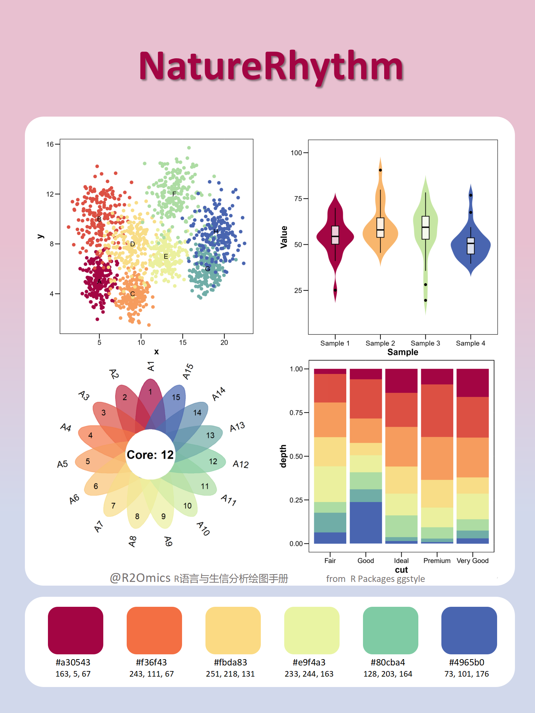
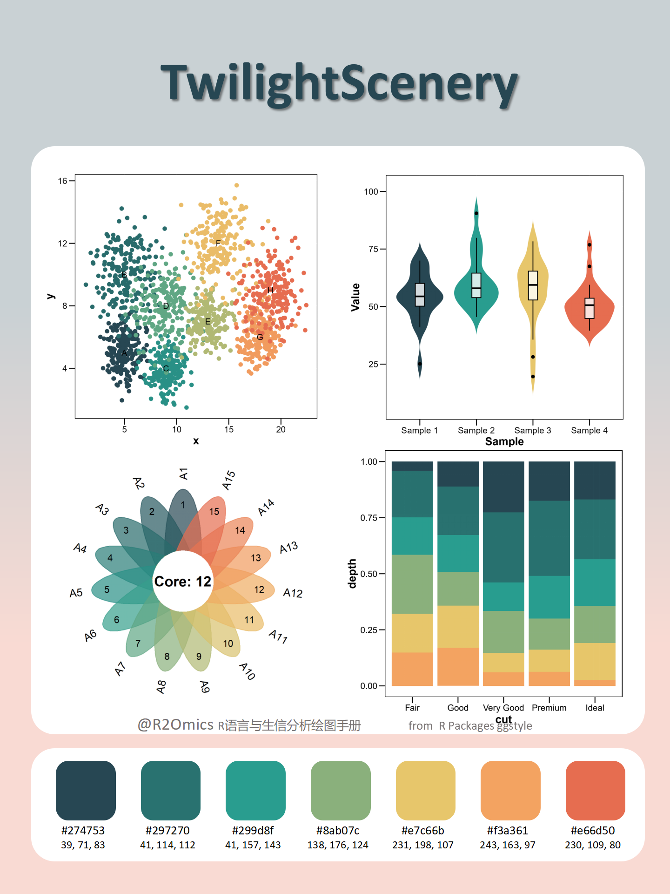
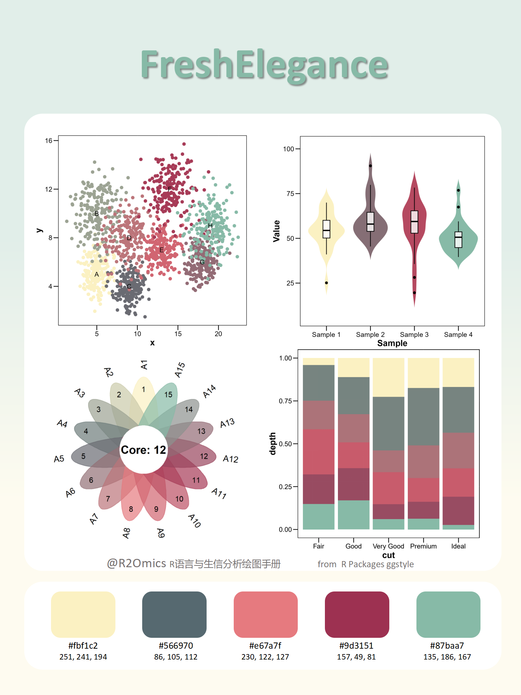
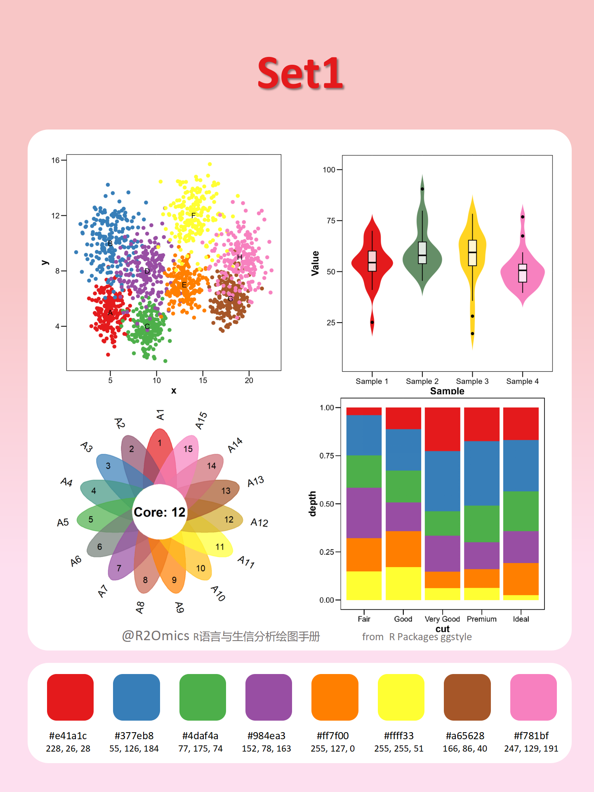
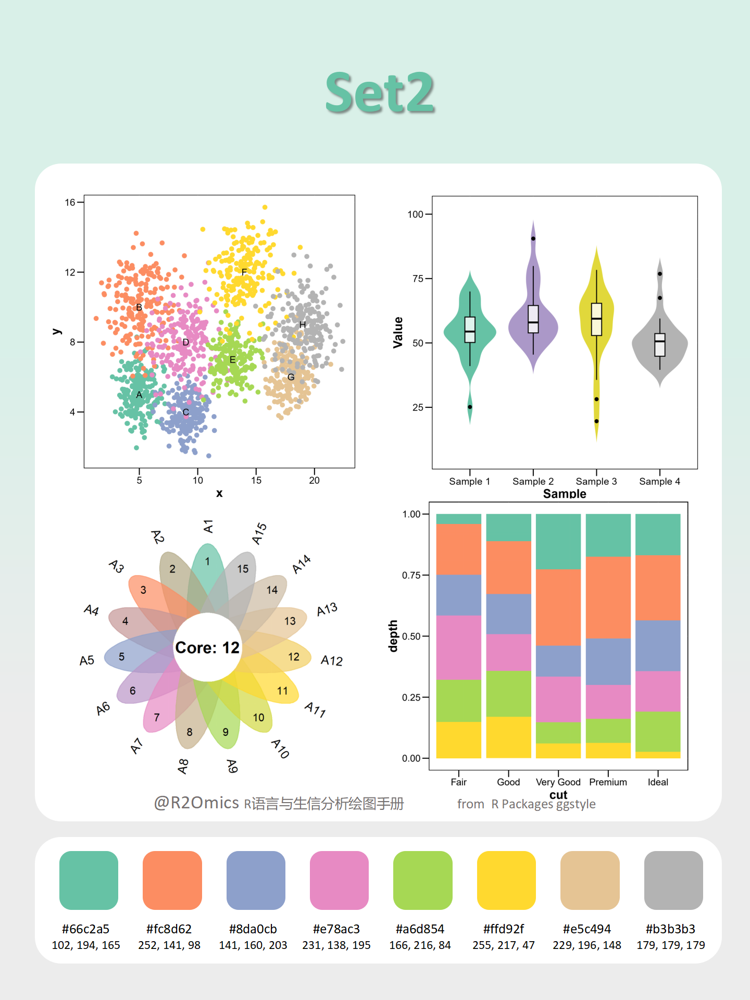
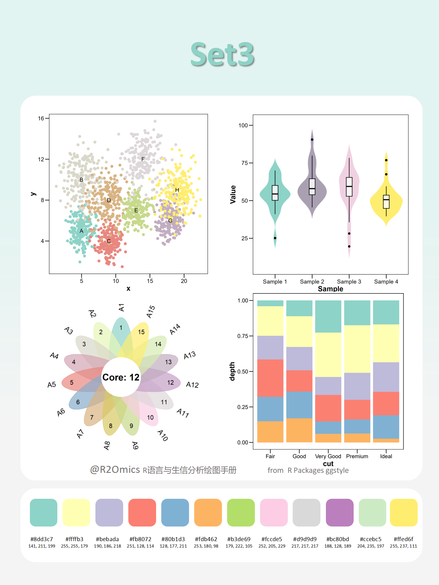
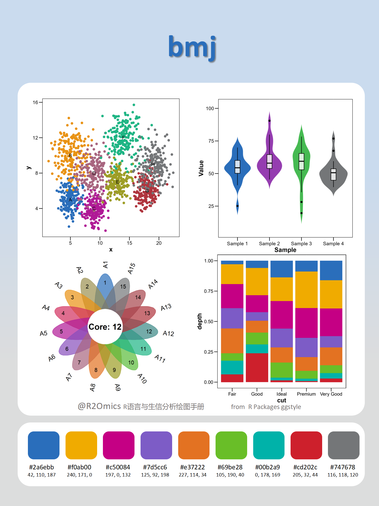
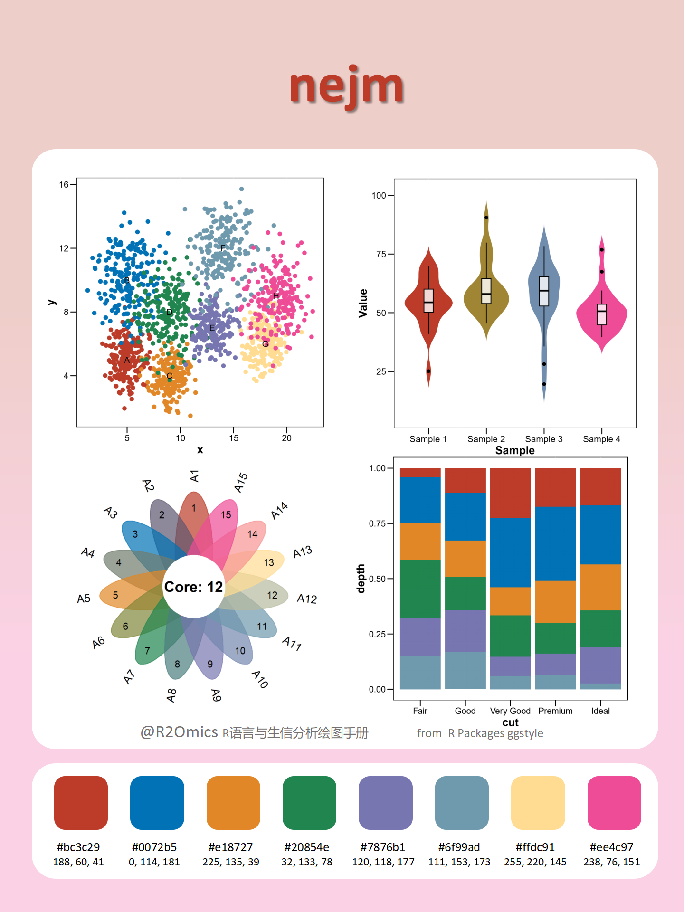

# ggstyle: Automated Color Setting for ggplot2

## Description

`ggstyle` provides a convenient way to apply customized color palettes to `ggplot2` plots, either for discrete or continuous data. The package includes a flexible function that automatically extends the color palette if it is smaller than required, making it easier to customize your visualizations.

## Installation

To install `ggstyle`, you can use the following command from GitHub:

```
# install.packages("devtools")
devtools::install_github("sz-zyp/ggstyle")
```

## Basic Usage

### Discrete Data Example

To apply a discrete color palette to a `ggplot2` plot, use `scale_color_sci()` with the desired parameters:

```
library(ggplot2)
library(ggstyle)

ggplot(mtcars, aes(x = wt, y = mpg, color = factor(cyl))) +
  geom_point(size = 4) +
  scale_color_sci(
    palette = "rainbow1",
    type = "discrete",
    modeColor = "auto",  # Automatically select the color
    name = "Cylinders",
    direction = 1  # Reverse the color scale
  )
```

### Continuous Data Example

For continuous data, use `scale_fill_sci()`:

```
ggplot(faithfuld, aes(waiting, eruptions, fill = density)) +
  geom_tile() +
  scale_fill_sci(
    palette = "rainbow1",
    type = "continuous"
  ) +
  labs(title = "Custom Continuous Color Scale Application")
```

## Function Details

### `scale_color_sci()`

Applies a color palette to `ggplot2` visualizations, either for discrete or continuous data. The palette can be customized using various parameters.

#### Parameters:

- `palette`: A vector of colors to use in the palette.
- `type`: Specifies the type of scale: `"discrete"` or `"continuous"`.
- `modeColor`: How colors are applied. Defaults to `"auto"`. If set to `"1"`, colors will be applied one by one.
- `na.value`: The color to use for missing (`NA`) values. Defaults to `"grey50"`.
- `aesthetics`: The aesthetic to map the color scale to. By default, it's `"colour"`.
- `direction`: The direction of the scale; `-1` means no change, and `1` means reversed.

### `scale_fill_sci()`

This is a companion function that applies the same color palette to the fill aesthetic of a plot (e.g., used with `geom_tile()` or other fill-based geometries).

------

For more advanced customization, you can pass additional arguments to the scale functions, such as `name`, `breaks`, and `limits`.

## Color Preview

The included colors are as follows:


Display























