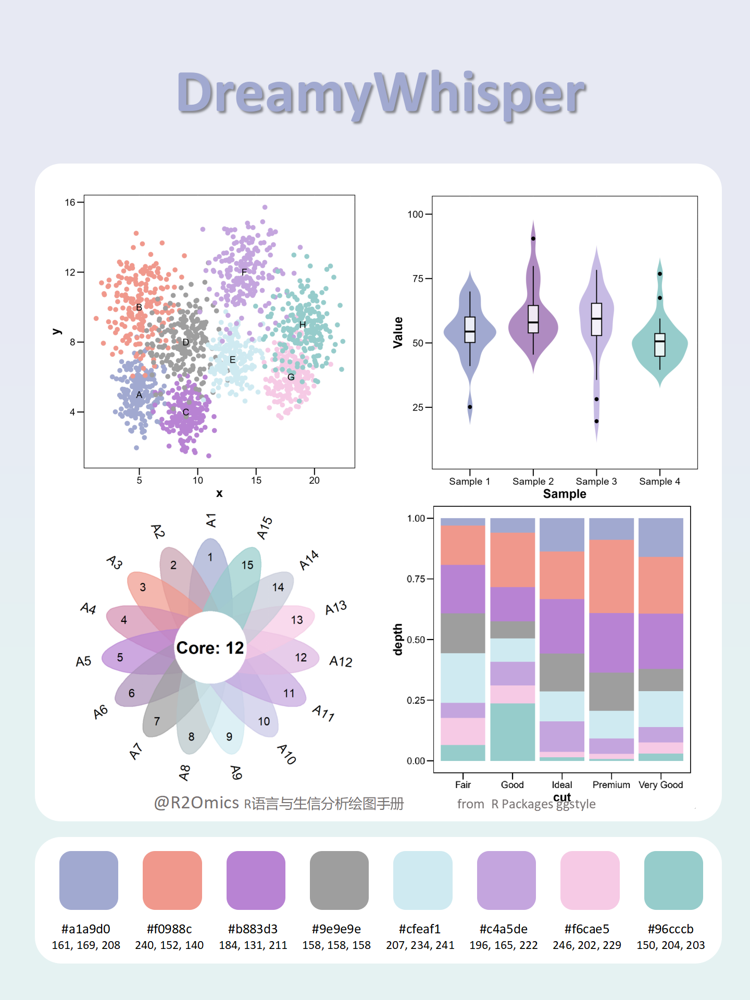

```{r, include = FALSE}
knitr::opts_chunk$set(
  collapse = TRUE,
  comment = "#>"
)
```

```{r setup}
library(ggstyle)
```

## Description

`ggstyle` provides a convenient way to apply customized color palettes to `ggplot2` plots, either for discrete or continuous data. The package includes a flexible function that automatically extends the color palette if it is smaller than required, making it easier to customize your visualizations.

## Basic Usage

### Discrete Data Example

To apply a discrete color palette to a `ggplot2` plot, use `scale_color_sci()` with the desired parameters:

```{r message=FALSE,fig.height=5,fig.width=5,warning=FALSE,eval=TRUE}
library(ggplot2)
library(ggstyle)

ggplot(mtcars, aes(x = wt, y = mpg, color = factor(cyl))) +
  geom_point(size = 4) +
  scale_color_sci(
    palette = "rainbow1",
    type = "discrete",
    modeColor = "auto",  # Automatically select the color
    name = "Cylinders",
    direction = 1  # Reverse the color scale
  )
```

### Continuous Data Example

For continuous data, use `scale_fill_sci()`:

```{r message=FALSE,fig.height=5,fig.width=5,warning=FALSE,eval=TRUE}
ggplot(faithfuld, aes(waiting, eruptions, fill = density)) +
  geom_tile() +
  scale_fill_sci(
    palette = "rainbow1",
    type = "continuous"
  ) +
  labs(title = "Custom Continuous Color Scale Application")
```

## Function Details

### `scale_color_sci()`

Applies a color palette to `ggplot2` visualizations, either for discrete or continuous data. The palette can be customized using various parameters.

#### Parameters:

-   `palette`: A vector of colors to use in the palette.
-   `type`: Specifies the type of scale: `"discrete"` or `"continuous"`.
-   `modeColor`: How colors are applied. Defaults to `"auto"`. If set to `"1"`, colors will be applied one by one.
-   `na.value`: The color to use for missing (`NA`) values. Defaults to `"grey50"`.
-   `aesthetics`: The aesthetic to map the color scale to. By default, it's `"colour"`.
-   `direction`: The direction of the scale; `-1` means no change, and `1` means reversed.

### `scale_fill_sci()`

This is a companion function that applies the same color palette to the fill aesthetic of a plot (e.g., used with `geom_tile()` or other fill-based geometries).

------------------------------------------------------------------------

For more advanced customization, you can pass additional arguments to the scale functions, such as `name`, `breaks`, and `limits`.

## Color Preview

The included colors are as follows:

```{r message=FALSE,fig.height=7,fig.width=7,warning=FALSE,eval=TRUE}
library(tidyverse)

pal_df <- ggstyle::paletteList %>%
  tibble::enframe(name = "palette", value = "colors") %>%
  unnest(colors) %>%
  group_by(palette) %>%
  mutate(position = row_number()) %>%
  ungroup()

pal_df = pal_df %>%
  filter(palette !="d3.category20") 


ggplot(pal_df, aes(x = position, y = factor(palette,levels = rev(unique(palette))), fill = colors)) +
  geom_tile(height = 0.85, width = 0.9, color = "white", linewidth = 0.3) +
  scale_fill_identity() +
  labs(x = NULL, y = NULL) +
  theme_minimal(base_size = 12) +
  theme(
    panel.grid  = element_blank(),
    axis.text.x  = element_blank(),
    axis.text.y  = element_text(face = "bold", color = "gray30"),
    plot.margin  = margin(20, 20, 20, 20)
  ) +
  coord_cartesian(expand = FALSE) 
```

Effect Display

{width="400"}

{width="400"}

{width="400"}

{width="400"}

{width="400"}

{width="400"}

{width="400"}

{width="400"}

{width="400"}

{width="400"}

{width="400"}

{width="400"}

{width="400"}

{width="400"}

{width="400"}

{width="400"}

{width="400"}

{width="400"}
